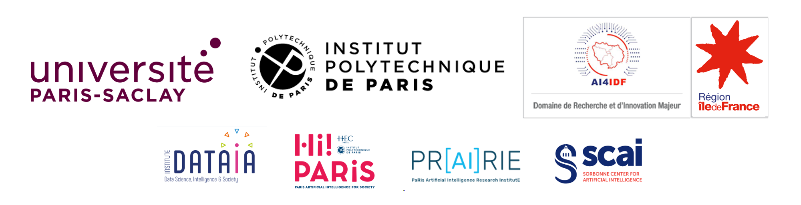

[**Description**](#description)
| [**Important Dates**](#important-dates)
| [**Speakers**](#speakers)

Institut Pascal  
530 rue Andre Riviere - Université Paris-Saclay  
91400 Orsay 
[https://www.google.com/maps/place/Institut+Pascal/@48.7064935,2.1748841,17z/data=!3m1!4b1!4m6!3m5!1s0x47e679e313480623:0x6a2cd8a232755c5d!8m2!3d48.7064935!4d2.177459!16s%2Fg%2F11h3_y9h34?entry=ttu&g_ep=EgoyMDI2MDMwOS4wIKXMDSoASAFQAw%3D%3D]

If you have any question, please ask Marie: marie.laveau@universite-paris-saclay.fr

## Description

P3S3 is an international thematic Summer School (June 01-05, 2026) co-organized by Université Paris-Saclay (GS ISN) and Institut Polytechnique de Paris (IDIA department). Mathematical concepts and applied mathematics are playing a central role in quantum technologies, from foundations to applications. The purpose of P3S3 is to provide Master’s students, PhD students, and early-stage researchers with a dedicated week of courses given by international experts to learn, discover, and deepen their understanding of quantum information science and quantum technologies through the lens of mathematics and theoretical computer science.

The school will consist of long (2h) tutorial talks, complemented by some shorter talks presenting some recent research results. It will also comprise mentoring sessions given by experienced professionals from academia and industry and poster sessions allowing participants to present and discuss their ongoing work.

The first day will start with a comprehensive introduction to quantum information with a presentation of the key concepts and formalism. The goal will be to provide enough knowledge about quantum information and quantum computing to attendees with no prior background in these fields.

Topics will include : 

* quantum foundations,
* quantum information theory, quantum cryptography, quantum control
* quantum algorithms and quantum computer science

## Target audience
* Master/PhD students or researchers with a background in AI/ML interested in the latest advances in generative AI.
* Master/PhD students or researchers from other fields eager to explore the potential of generative AI for their work.

If you fit either description, this autumn school is for you!
    
## Important Dates
* First round application deadline: 16th of June 2024
* Notification to applicants: 30th of June 2024
* Second round application deadline: 16th of July 2024
* Notification to applicants: 30th of July 2024
* Master students notification: after the 15th of September 2024
* **School: 21-25 October 2024**

All deadlines are 23:59 AoE (UTC-12)

## Speakers 

### Keynote
* **[Xavier Alameda-Pineda](http://xavirema.eu/)** - Inria at University Grenoble Alpes, Grenoble, France
* **[Antoine Bosselut](https://atcbosselut.github.io/)** - EPFL
* **[Claire Boyer](https://www.imo.universite-paris-saclay.fr/~claire.boyer/)** - Sorbonne University
* **[Merouane Debbah](https://www.ku.ac.ae/college-people/merouane-debbah)** - Khalifa University
* **[Manuel Faysse](https://manuelfay.github.io/#)** - CentraleSupélec, Université Paris-Saclay/Illuin Technology
* **[Vicky Kalogeiton](https://vicky.kalogeiton.info/)** - LIX, IPP
* **[Eric Moulines](http://www.cmapx.polytechnique.fr/~moulines/)** - Ecole Polytechnique
* **[Claire Monteleoni](https://www.colorado.edu/faculty/claire-monteleoni/)** - University of Colorado Boulder/INRIA
* **[Alasdair Newson](https://sites.google.com/site/alasdairnewson/)** - Sorbonne Université
* **[Gaël Richard](https://www.telecom-paris.fr/gael-richard)** - IPP/Télécom Paris
* **[Yunhao (Robin) Tang](https://robintyh1.github.io/)** - Meta GenAI London
* **[Denis Trystam](https://datamove.imag.fr/denis.trystram/)** - Grenoble INP

### Lab session 
* **[Manuel Faysse](https://manuelfay.github.io/#)** - CentraleSupélec, Université Paris-Saclay/Illuin Technology
* **[Badr Moufad](https://github.com/Badr-MOUFAD)** - LIX, IPP
* **[Yazid Janati](https://yazidjanati.github.io/)** - LIX, IPP
* **[Yunhao (Robin) Tang](https://robintyh1.github.io/)** - Meta GenAI London
* **Xi Wang** - LIX, IPP

More information about the speakers [here](./speakers).

