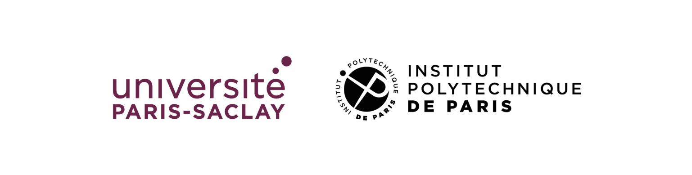

[**Description**](#description)
| [**Application**](#Application-and-Registration-a-2-phase-procedure)
| [**Important Dates**](#important-dates)
| [**Speakers**](#speakers)

Institut Pascal  
530 rue Andre Riviere - Université Paris-Saclay  
91400 Orsay 
[https://maps.app.goo.gl/R8eZxAFVfTzs4zjA8](https://maps.app.goo.gl/R8eZxAFVfTzs4zjA8) 

If you have any question, please ask: gs.isn@universite-paris-saclay.fr

# Description

P3S3 is an international thematic Summer School to be held from June 1 to June 5, 2026, co-organized by Université Paris-Saclay (Graduate School ISN)and Institut Polytechnique de Paris at the Institut Pascal.

Data protection, security, and privacy are central challenges in modern information technologies, spanning both theoretical foundations and practical applications. The main objective of P3S3 is to provide an in-depth introduction to these topics through the presentation of several cryptographic protocols, from their underlying mathematical principles to their concrete real-world deployment. A second objective of the school is to introduce formal methods and tools for analyzing the security of these protocols. To this end, the program is structured around several main thematic areas:

* cryptographic protocols: zero-knowledge proofs, homomorphic encryption, and electronic voting
* formal methods for security analysis: protocols and code analysis
* privacy-enhancing technologies (PETS): technical and legal aspects 

P3S3 is primarily aimed at PhD students, as well as early-stage researchers, and offers a full week of lectures delivered by leading experts in these fields. In addition, by bringing together researchers from different communities, the school seeks to foster new interactions and strengthen collaborations.

# Application and Registration: a 2-phase procedure
To participate in the summer school, you will first have to apply, and then, after a review process, you will receive a link to register.
We welcome European applications, and a few “housing” grants will be allocated to support PhD students, covering housing and registration fees.

## Application 
Depending on your status, information will be asked: 
* PhD student: CV and motivation letter 
* Academic & Industry: CV
  
There will be two rounds for applications:

* First round:
    * Until March 30 (23:59 Paris time).
    * Notification of acceptance: after April 15. 
* Second round:
    * From April 1 to April 15 (23:59 Paris time).
    * Notification of acceptance: after May 4. 

Application form: [https://admin-sphinx.universite-paris-saclay.fr/SurveyServer/s/GSchimieCompSci/InscriptionP3S3-school/questionnaire.htm](https://admin-sphinx.universite-paris-saclay.fr/SurveyServer/s/GSchimieCompSci/InscriptionP3S3-school/questionnaire.htm)

## Registration
After the notification of acceptance, you will receive the link to register and how to pay the fees. 

### Registration Fees
* Students (Master and PhD students): 100€
* Academics: 250€
* Industry: 500€
  
The fees will cover lectures, coffee breaks, lunches, the social event, and the gala dinner.
Please note that accommodation and travel costs are not covered.

You can pay by bank transfer or a ‘bon de commande’ (this latter option is only for participants from French companies or institutions).
Payment by credit card is not available.
If you need a bill, ask us, and be aware that there may be a delay. 

# Important Date
* First round application deadline: March 30.
* Notification of acceptance: after April 15. 
* Second round application deadline: April 15.
* Notification of acceptance: after May 4. 
* **School: 01-05 June 2026**     

All deadlines are in UTC+1 (Paris time). 

# Organizers
* Maïwenn Racouchot, LMF, Université Paris-Saclay 
* Sorina Ionica, DAVID, UVSQ, Université Paris-Saclay
* Nesrine Kaaniche, Télécom Sud Paris, Institut Polytechnique de Paris 
* Julien Signoles, CEA List, Université Paris-Saclay
* Marie Laveau, GS ISN, Université Paris-Saclay

# Keynote Speakers (not stabilized)
* Besson Frédéric, Inria, Univ Rennes, CNRS, IRISA
* Boudguiga Aymen, CEA                                                              https://aymen0b.github.io/
* Cremers Cas, CISPA Helmholtz Center for Information Security                     https://cispa.de/en/people/cas.cremers
* Debant Alexandre, Inria, Nancy
* Faonio Antonio, EURECOM, Sophia Antipolis                                        https://faonio.eurecom.io/
* Feneuil Thibault, CryptoExperts                                                  https://www.thibauld-feneuil.fr/
* Izabachene Malika, ETIS UMR 8051, CY Cergy Paris Université, ENSEA, CNRS         https://izama.github.io/
* Levallois-Barth Claire, IMT Atlantique, DI2S
* Palamidessi Catuscia, COMETE, LIX, INRIA Saclay, IPP                             https://www.lix.polytechnique.fr/~catuscia/

