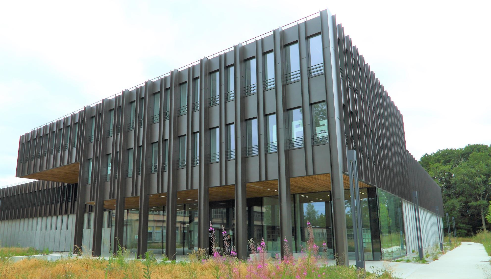
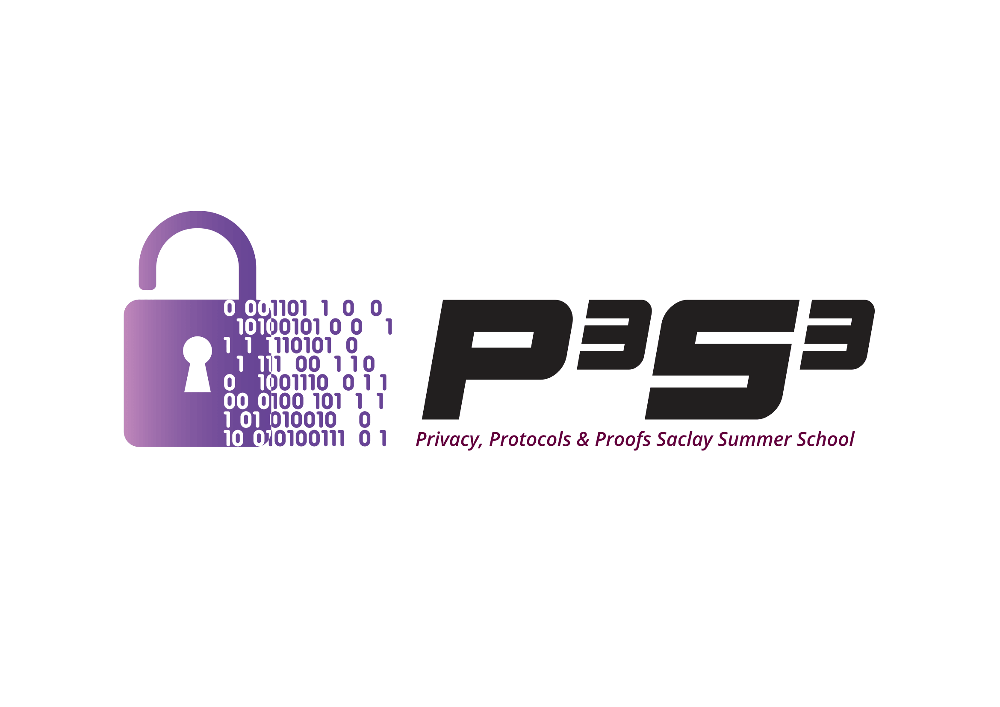
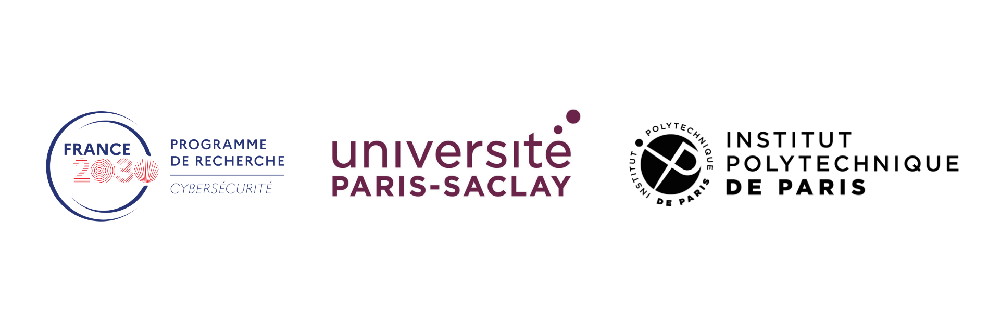

[**Description**](#description)
| [**Application and Registration**](#application-and-registration)
| [**Important Dates**](#important-dates)
| [**Lecturers**](#lecturers)

  

  

    
<strong>Institut Pascal</strong> 
    530 rue Andre Riviere - Université Paris-Saclay  
    91400 Orsay, France 
    <a href="https://maps.app.goo.gl/R8eZxAFVfTzs4zjA8">View on map</a>

    

More information about the venue <a href="/venue.html">here</a>.

If you have any question, please ask: gs.isn@universite-paris-saclay.fr

    
  

## Description

P3S3 is an international thematic Summer School to be held from June 1 to June 5, 2026, co-organized by Université Paris-Saclay (Graduate School ISN) and Institut Polytechnique de Paris at the Institut Pascal.

Data protection, security, and privacy are central challenges in modern information technologies, spanning both theoretical foundations and practical applications. The main objective of P3S3 is to provide an in-depth introduction to these topics through the presentation of several cryptographic protocols, from their underlying mathematical principles to their concrete real-world deployment. A second objective of the school is to introduce formal methods and tools for analyzing the security of these protocols. To this end, the program is structured around several main thematic areas:

* cryptographic protocols: zero-knowledge proofs, homomorphic encryption, and electronic voting
* formal methods for security analysis: protocols and code analysis
* privacy-enhancing technologies (PETS): technical and legal aspects 

P3S3 is primarily aimed at PhD students, as well as early-stage researchers, and offers a full week of lectures delivered by leading experts in these fields. In addition, by bringing together researchers from different communities, the school seeks to foster new interactions and strengthen collaborations.

Participants will also have the opportunity to present a poster.

🏆A Best Poster Award will be awarded to recognize the most outstanding poster presentation.

## Application and Registration

## A 2-step procedure
To participate in the summer school, you will first have to apply, and then, after a review process, you will receive a link to register.
We welcome European applications, and a few “housing” grants will be allocated to support PhD students, covering housing and registration fees.

## Application 
Depending on your status, information will be asked: 
* PhD student: CV and motivation letter 
* Academic & Industry: CV
  
There will be two rounds for applications:

* First round:
    * Until March 30 (23:59 Paris time).
    * Notification of acceptance: after April 15. 
* Second round:
    * From April 1 to April 24 (23:59 Paris time).
    * Notification of acceptance: after May 4. 

Application form: [https://admin-sphinx.universite-paris-saclay.fr/SurveyServer/s/GSchimieCompSci/InscriptionP3S3-school/questionnaire.htm](https://admin-sphinx.universite-paris-saclay.fr/SurveyServer/s/GSchimieCompSci/InscriptionP3S3-school/questionnaire.htm)

## Registration
After the notification of acceptance, you will receive the link to register and how to pay the fees. 

### Registration Fees
* Students (Master and PhD students): 100€
* Academics: 250€
* Industry: 500€
  
The fees will cover lectures, coffee breaks, lunches, the social event, and the gala dinner.
Please note that accommodation and travel costs are not covered.

You can pay by bank transfer or a ‘bon de commande’ (this latter option is only for participants from French companies or institutions).
Payment by credit card is not available.
If you need a bill, ask us, and be aware that there may be a delay. 

## Important Dates
* First round application deadline: March 30.
* Notification of acceptance: after April 15. 
* Second round application deadline: April 15.
* Notification of acceptance: after May 4. 
* **School: June 1-5, 2026**     

All deadlines are in UTC+1 (Paris time). 

## Lecturers
* **[Belguith Sana](https://www.bristol.ac.uk/people/person/Sana-Belguith-697f20a9-c9f2-4b7b-b2c7-a68f10fca1a4/)** - School of Computer Science, the University of Bristol, UK
* **[Besson Frédéric](https://people.rennes.inria.fr/Frederic.Besson/)** - Inria, Univ Rennes, CNRS, IRISA
* **[Boudguiga Aymen](https://aymen0b.github.io/)** - CEA LIST, Université Paris-Saclay                                                       
* **[Cremers Cas](https://cispa.de/en/people/cas.cremers)** - CISPA Helmholtz Center for Information Security
* **[Debant Alexandre](https://members.loria.fr/ADebant/)** - Inria, Nancy
* **[Faonio Antonio](https://faonio.eurecom.io/)** - EURECOM, Sophia Antipolis                                     
* **[Feneuil Thibauld](https://www.thibauld-feneuil.fr/)** - CryptoExperts                                            
* **[Izabachène Malika](https://izama.github.io/)** - ETIS, CY Cergy Paris Université, ENSEA, CNRS  
* **[Levallois-Barth Claire](https://www.imt-atlantique.fr/fr/personne/claire-levallois-barth)** - IMT Atlantique
* **[Palamidessi Catuscia](https://www.lix.polytechnique.fr/~catuscia/)** - LIX, INRIA Saclay, IPP
  
More information about the program [here](https://p3s3.github.io/program).

## Organizers
* **[Ionica Sorina](https://home.mis.u-picardie.fr/~ionica/)** - LMV, UVSQ, Université Paris-Saclay
* **[Kaaniche Nesrine](https://scholar.google.com/citations?user=eYnrxhgAAAAJ&hl=en)** - Télécom Sud Paris, Institut Polytechnique de Paris
* **[Laveau Marie](https://laveaumarie.github.io)** - GS ISN, Université Paris-Saclay
* **[Racouchot Maïwenn](https://www.google.com/url?sa=t&source=web&rct=j&opi=89978449&url=https://dblp.org/pid/353/7545&ved=2ahUKEwiro62JoruTAxXYQ6QEHYh3FFwQFnoECB8QAQ&usg=AOvVaw0KugDbwU1MCjXNpM9FNfsA)** - LMF, Université Paris-Saclay
* **[Signoles Julien](https://julien-signoles.fr)** - CEA List, Université Paris-Saclay
  

