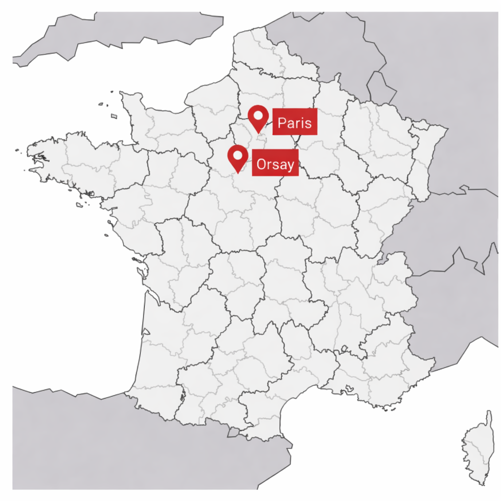
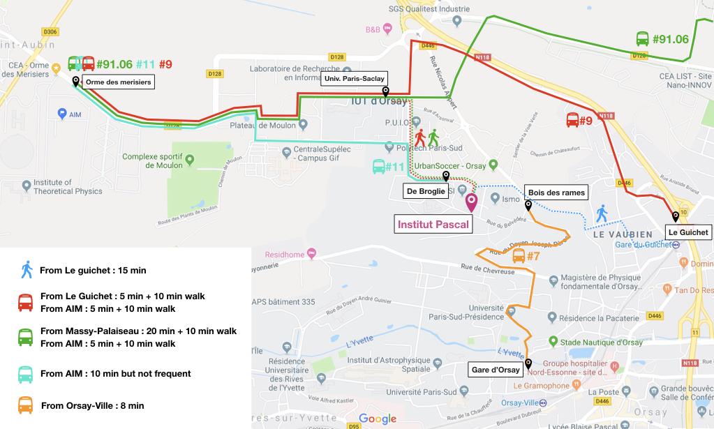

# Venue
The school will take place in the Institut Pascal, 530 rue Andre Riviere - Université Paris-Saclay - 91400 Orsay, France [https://maps.app.goo.gl/R8eZxAFVfTzs4zjA8](https://maps.app.goo.gl/R8eZxAFVfTzs4zjA8).

 

  

  

# Accomadation suggestions 
* *[Campanile Paris Saclay](https://paris-saclay.campanile.com/fr-fr/)*
* *[B&B Hôtel Saclay](https://www.hotel-bb.com/fr/hotel/saclay?utm_source=googlemaps&utm_medium=fichehotel&utm_campaign=yext)*
* *[Aparthôtel Adagio Access Paris Massy](https://www.adagio-city.com/fr/hotel-8696-aparthotel-adagio-access-paris-massy-gare-tgv/index.shtml?utm_source=googleMaps&utm_medium=seoMaps&utm_campaign=seoMaps&y_source=1_MTUzNjE3NTktNzE1LWxvY2F0aW9uLndlYnNpdGU%3D)*
* *[AllSuites Appart Hôtel Massy-Palaiseau](https://www.allsuites.com/hotel/appart-hotel-massy-palaiseau)*
* *[Accor Hôtel Massy Gare TGV](https://all.accor.com/hotel/1176/index.fr.shtml)*
* *[Hôtel d'Orsay](https://www.orsay-hotel.com)*
